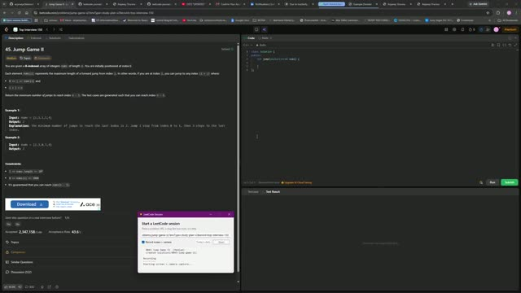

# 0045. Jump Game II

 &nbsp;&middot;&nbsp; [Open on LeetCode](https://leetcode.com/problems/jump-game-ii/) &nbsp;&middot;&nbsp; Solved **2026-10-05**

`Array`  `Dynamic Programming`  `Greedy`

## Walkthrough

| Screen recording | Camera |
|:--:|:--:|
| [](media/screen.mp4)<br><sub>8m 33s &middot; 6 MB</sub> | [](media/camera.mp4)<br><sub>8m 30s &middot; 7 MB</sub> |

## Solution

### C++ <sub>[solution.cpp](solution.cpp)</sub>

```cpp
class Solution {
public:
    int jump(vector<int>& nums) {
        int jumps = 0;
        int range = 0;
        int j = 0;
        for(int i = 0; i < nums.size() - 1; i++){
            range = max(range, i + nums[i]);
            if(i == j){
                jumps++;
                j = range;
            }
        }
        return jumps;
    }
};
```

## Problem

You are given a **0-indexed** array of integers `nums` of length `n`. You are initially positioned at index 0.

Each element `nums[i]` represents the maximum length of a forward jump from index `i`. In other words, if you are at index `i`, you can jump to any index `(i + j)` where:

- `0 <= j <= nums[i]` and

- `i + j < n`

Return _the minimum number of jumps to reach index _`n - 1`. The test cases are generated such that you can reach index `n - 1`.

Example 1:**

```

**Input:** nums = [2,3,1,1,4]
**Output:** 2
**Explanation:** The minimum number of jumps to reach the last index is 2. Jump 1 step from index 0 to 1, then 3 steps to the last index.

```

Example 2:**

```

**Input:** nums = [2,3,0,1,4]
**Output:** 2

```

**Constraints:**

- `1 <= nums.length <= 10^4`

- `0 <= nums[i] <= 1000`

- It's guaranteed that you can reach `nums[n - 1]`.

---

<sub>Recorded and published with the [leetcode-journal](../../README.md) setup.</sub>
