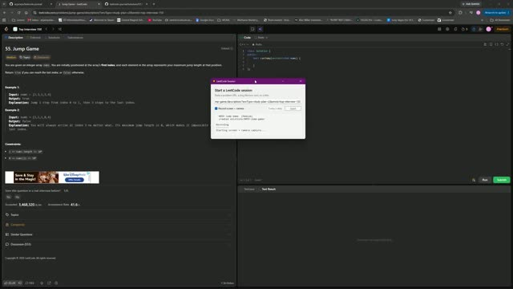

# 0055. Jump Game

 &nbsp;&middot;&nbsp; [Open on LeetCode](https://leetcode.com/problems/jump-game/) &nbsp;&middot;&nbsp; Solved **2026-10-04**

`Array`  `Dynamic Programming`  `Greedy`

## Walkthrough

| Screen recording | Camera |
|:--:|:--:|
| [](media/screen.mp4)<br><sub>15m 6s &middot; 12 MB</sub> | [](media/camera.mp4)<br><sub>15m 7s &middot; 10 MB</sub> |

## Solution

### C++ <sub>[solution.cpp](solution.cpp)</sub>

```cpp
class Solution {
public:
    bool canJump(vector<int>& nums) {
        int range = 0;
        for(int i = 0; i < nums.size(); i++){
            if(i > range){
                return false;
            }
            range = max(range ,nums[i] + i);
            if(range >= nums.size()){
                return true;
            }
        }
        return true;
    }
};
```

## Problem

You are given an integer array `nums`. You are initially positioned at the array's **first index**, and each element in the array represents your maximum jump length at that position.

Return `true`_ if you can reach the last index, or _`false`_ otherwise_.

Example 1:**

```

**Input:** nums = [2,3,1,1,4]
**Output:** true
**Explanation:** Jump 1 step from index 0 to 1, then 3 steps to the last index.

```

Example 2:**

```

**Input:** nums = [3,2,1,0,4]
**Output:** false
**Explanation:** You will always arrive at index 3 no matter what. Its maximum jump length is 0, which makes it impossible to reach the last index.

```

**Constraints:**

- `1 <= nums.length <= 10^4`

- `0 <= nums[i] <= 10^5`

---

<sub>Recorded and published with the [leetcode-journal](../../README.md) setup.</sub>
