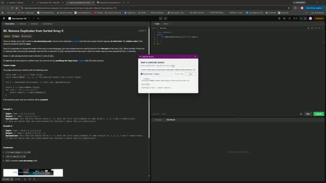

# 0080. Remove Duplicates from Sorted Array II

 &nbsp;&middot;&nbsp; [Open on LeetCode](https://leetcode.com/problems/remove-duplicates-from-sorted-array-ii/) &nbsp;&middot;&nbsp; Solved **2026-09-20**

`Array`  `Two Pointers`

## Walkthrough

| Screen recording | Camera |
|:--:|:--:|
| [](media/screen.mp4)<br><sub>16m 42s &middot; 14 MB</sub> | [](media/camera.mp4)<br><sub>16m 37s &middot; 13 MB</sub> |

## Notes

class Solution {
public:
    int removeDuplicates(vector<int>& nums) {
        int k = 0;
        for(int i = 0; i < nums.size(); i++){
            if(k < 2 || nums[i] != nums[k-2]){
                nums[k++] = nums[i];
            }
        }
        return k;
    }
};

## Solution

### C++ <sub>[solution.cpp](solution.cpp)</sub>

```cpp
class Solution {
public:
    int removeDuplicates(vector<int>& nums) {
        int k = 0;
        for(int i = 0; i < nums.size(); i++){
            if(k < 2 || nums[i] != nums[k-2]){
                nums[k++] = nums[i];
            }
        }
        return k;
    }
};
```

## Problem

Given an integer array `nums` sorted in **non-decreasing order**, remove some duplicates **in-place** such that each unique element appears **at most twice**. The **relative order** of the elements should be kept the **same**.

Since it is impossible to change the length of the array in some languages, you must instead have the result be placed in the **first part** of the array `nums`. More formally, if there are `k` elements after removing the duplicates, then the first `k` elements of `nums` should hold the final result. It does not matter what you leave beyond the first `k` elements.

Return `k`_ after placing the final result in the first _`k`_ slots of _`nums`.

Do **not** allocate extra space for another array. You must do this by **modifying the input array in-place** with O(1) extra memory.

**Custom Judge:**

The judge will test your solution with the following code:

```

int[] nums = [...]; // Input array
int[] expectedNums = [...]; // The expected answer with correct length

int k = removeDuplicates(nums); // Calls your implementation

assert k == expectedNums.length;
for (int i = 0; i < k; i++) {
    assert nums[i] == expectedNums[i];
}

```

If all assertions pass, then your solution will be **accepted**.

Example 1:**

```

**Input:** nums = [1,1,1,2,2,3]
**Output:** 5, nums = [1,1,2,2,3,_]
**Explanation:** Your function should return k = 5, with the first five elements of nums being 1, 1, 2, 2 and 3 respectively.
It does not matter what you leave beyond the returned k (hence they are underscores).

```

Example 2:**

```

**Input:** nums = [0,0,1,1,1,1,2,3,3]
**Output:** 7, nums = [0,0,1,1,2,3,3,_,_]
**Explanation:** Your function should return k = 7, with the first seven elements of nums being 0, 0, 1, 1, 2, 3 and 3 respectively.
It does not matter what you leave beyond the returned k (hence they are underscores).

```

**Constraints:**

- `1 <= nums.length <= 3 * 10^4`

- `-10^4 <= nums[i] <= 10^4`

- `nums` is sorted in **non-decreasing** order.

---

<sub>Recorded and published with the [leetcode-journal](../../README.md) setup.</sub>
