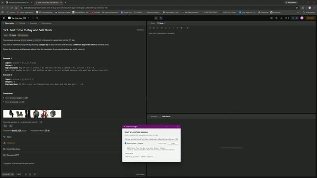

# 0121. Best Time to Buy and Sell Stock

 &nbsp;&middot;&nbsp; [Open on LeetCode](https://leetcode.com/problems/best-time-to-buy-and-sell-stock/) &nbsp;&middot;&nbsp; Solved **2026-09-23**

`Array`  `Dynamic Programming`

## Walkthrough

| Screen recording | Camera |
|:--:|:--:|
| [](media/screen.mp4)<br><sub>12m 52s &middot; 10 MB</sub> | [](media/camera.mp4)<br><sub>12m 49s &middot; 10 MB</sub> |

## Notes

class Solution {
public:
    int maxProfit(vector<int>& prices) {
        int minPrice = INT_MAX;
        int val = 0;
        for(int i = 0; i < prices.size(); i++){
            if(prices[i] < minPrice){
                minPrice = prices[i];
            }

            int diff = prices[i] - minPrice;

            if(diff > val){
                val = diff;
            }
        }
        return val;
    }
};

## Solution

### C++ <sub>[solution.cpp](solution.cpp)</sub>

```cpp
class Solution {
public:
    int maxProfit(vector<int>& prices) {
        int minPrice = INT_MAX;
        int val = 0;
        for(int i = 0; i < prices.size(); i++){
            if(prices[i] < minPrice){
                minPrice = prices[i];
            }

            int diff = prices[i] - minPrice;

            if(diff > val){
                val = diff;
            }
        }
        return val;
    }
};
```

## Problem

You are given an array `prices` where `prices[i]` is the price of a given stock on the `i^th` day.

You want to maximize your profit by choosing a **single day** to buy one stock and choosing a **different day in the future** to sell that stock.

Return _the maximum profit you can achieve from this transaction_. If you cannot achieve any profit, return `0`.

Example 1:**

```

**Input:** prices = [7,1,5,3,6,4]
**Output:** 5
**Explanation:** Buy on day 2 (price = 1) and sell on day 5 (price = 6), profit = 6-1 = 5.
Note that buying on day 2 and selling on day 1 is not allowed because you must buy before you sell.

```

Example 2:**

```

**Input:** prices = [7,6,4,3,1]
**Output:** 0
**Explanation:** In this case, no transactions are done and the max profit = 0.

```

**Constraints:**

- `1 <= prices.length <= 10^5`

- `0 <= prices[i] <= 10^4`

---

<sub>Recorded and published with the [leetcode-journal](../../README.md) setup.</sub>
