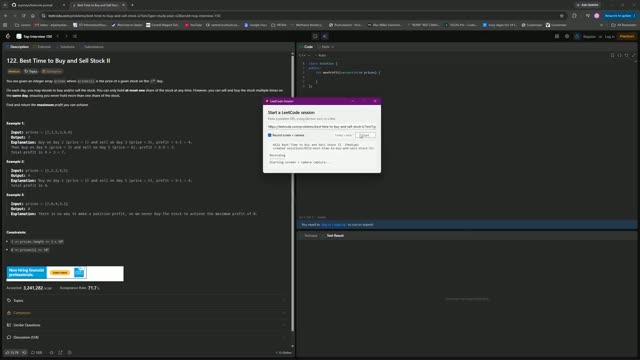

# 0122. Best Time to Buy and Sell Stock II

 &nbsp;&middot;&nbsp; [Open on LeetCode](https://leetcode.com/problems/best-time-to-buy-and-sell-stock-ii/) &nbsp;&middot;&nbsp; Solved **2026-10-04**

`Array`  `Dynamic Programming`  `Greedy`

## Walkthrough

| Screen recording | Camera |
|:--:|:--:|
| [](media/screen.mp4)<br><sub>5m 42s &middot; 5 MB</sub> | [](media/camera.mp4)<br><sub>5m 43s &middot; 5 MB</sub> |

## Notes

class Solution {
public:
    int maxProfit(vector<int>& prices) {
        int profit = 0;
        for(int i = 1; i < prices.size(); i++){
            if(prices[i] > prices[i - 1]){
                profit += prices[i] - prices[i-1];
            }
        }
        return profit;
    }
};

## Solution

### C++ <sub>[solution.cpp](solution.cpp)</sub>

```cpp
class Solution {
public:
    int maxProfit(vector<int>& prices) {
        int profit = 0;
        for(int i = 1; i < prices.size(); i++){
            if(prices[i] > prices[i - 1]){
                profit += prices[i] - prices[i-1];
            }
        }
        return profit;
    }
};
```

## Problem

You are given an integer array `prices` where `prices[i]` is the price of a given stock on the `i^th` day.

On each day, you may decide to buy and/or sell the stock. You can only hold **at most one** share of the stock at any time. However, you can sell and buy the stock multiple times on the **same day**, ensuring you never hold more than one share of the stock.

Find and return _the **maximum** profit you can achieve_.

Example 1:**

```

**Input:** prices = [7,1,5,3,6,4]
**Output:** 7
**Explanation:** Buy on day 2 (price = 1) and sell on day 3 (price = 5), profit = 5-1 = 4.
Then buy on day 4 (price = 3) and sell on day 5 (price = 6), profit = 6-3 = 3.
Total profit is 4 + 3 = 7.

```

Example 2:**

```

**Input:** prices = [1,2,3,4,5]
**Output:** 4
**Explanation:** Buy on day 1 (price = 1) and sell on day 5 (price = 5), profit = 5-1 = 4.
Total profit is 4.

```

Example 3:**

```

**Input:** prices = [7,6,4,3,1]
**Output:** 0
**Explanation:** There is no way to make a positive profit, so we never buy the stock to achieve the maximum profit of 0.

```

**Constraints:**

- `1 <= prices.length <= 3 * 10^4`

- `0 <= prices[i] <= 10^4`

---

<sub>Recorded and published with the [leetcode-journal](../../README.md) setup.</sub>
