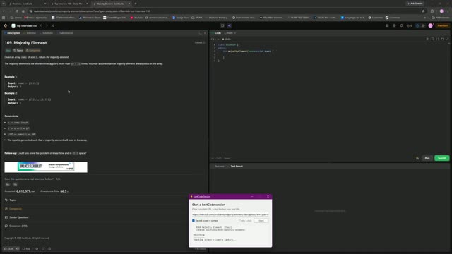

# 0169. Majority Element

 &nbsp;&middot;&nbsp; [Open on LeetCode](https://leetcode.com/problems/majority-element/) &nbsp;&middot;&nbsp; Solved **2026-09-21**

`Array`  `Hash Table`  `Divide and Conquer`  `Sorting`  `Counting`  `Boyer–Moore Majority Vote Algorithm`

## Walkthrough

| Screen recording | Camera |
|:--:|:--:|
| [](media/screen.mp4)<br><sub>23m 5s &middot; 23 MB</sub> | [](media/camera.mp4)<br><sub>23m 4s &middot; 18 MB</sub> |

## Notes

class Solution {
public:
    int majorityElement(vector<int>& nums) {
        int n = nums.size();
        unordered_map<int, int> map;
        for(int i = 0; i < n; i++){
            map[nums[i]]++;
        }
        for(int j = 0; j < n; j++){
            if(map[nums[j]] > n / 2){
                return nums[j];
            }
        }
        return 0;
    }
};

## Solution

### C++ <sub>[solution.cpp](solution.cpp)</sub>

```cpp
class Solution {
public:
    int majorityElement(vector<int>& nums) {
        int n = nums.size();
        unordered_map<int, int> map;
        for(int i = 0; i < n; i++){
            map[nums[i]]++;
        }
        for(int j = 0; j < n; j++){
            if(map[nums[j]] > n / 2){
                return nums[j];
            }
        }
        return 0;
    }
};
```

## Problem

Given an array `nums` of size `n`, return _the majority element_.

The majority element is the element that appears more than `⌊n / 2⌋` times. You may assume that the majority element always exists in the array.

Example 1:**

```
**Input:** nums = [3,2,3]
**Output:** 3

```
Example 2:**

```
**Input:** nums = [2,2,1,1,1,2,2]
**Output:** 2

```

**Constraints:**

- `n == nums.length`

- `1 <= n <= 5 * 10^4`

- `-10^9 <= nums[i] <= 10^9`

- The input is generated such that a majority element will exist in the array.

**Follow-up:** Could you solve the problem in linear time and in `O(1)` space?

---

<sub>Recorded and published with the [leetcode-journal](../../README.md) setup.</sub>
