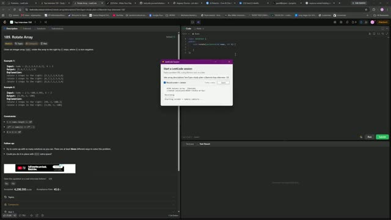

# 0189. Rotate Array

 &nbsp;&middot;&nbsp; [Open on LeetCode](https://leetcode.com/problems/rotate-array/) &nbsp;&middot;&nbsp; Solved **2026-09-22**

`Array`  `Math`  `Two Pointers`

## Walkthrough

| Screen recording | Camera |
|:--:|:--:|
| [](media/screen.mp4)<br><sub>10m 2s &middot; 8 MB</sub> | [](media/camera.mp4)<br><sub>10m 0s &middot; 8 MB</sub> |

## Notes

class Solution {
public:
    void rotate(vector<int>& nums, int k) {
        vector<int> result(nums.size()); 
        for(int i = 0; i < nums.size(); i++){
            result[(i + k) % nums.size()] = nums[i];
        }
        nums = result;
    }
};

## Solution

### C++ <sub>[solution.cpp](solution.cpp)</sub>

```cpp
class Solution {
public:
    void rotate(vector<int>& nums, int k) {
        vector<int> result(nums.size());
        for(int i = 0; i < nums.size(); i++){
            result[(i + k) % nums.size()] = nums[i];
        }
        nums = result;
    }
};
```

## Problem

Given an integer array `nums`, rotate the array to the right by `k` steps, where `k` is non-negative.

Example 1:**

```

**Input:** nums = [1,2,3,4,5,6,7], k = 3
**Output:** [5,6,7,1,2,3,4]
**Explanation:**
rotate 1 steps to the right: [7,1,2,3,4,5,6]
rotate 2 steps to the right: [6,7,1,2,3,4,5]
rotate 3 steps to the right: [5,6,7,1,2,3,4]

```

Example 2:**

```

**Input:** nums = [-1,-100,3,99], k = 2
**Output:** [3,99,-1,-100]
**Explanation:**
rotate 1 steps to the right: [99,-1,-100,3]
rotate 2 steps to the right: [3,99,-1,-100]

```

**Constraints:**

- `1 <= nums.length <= 10^5`

- `-2^31 <= nums[i] <= 2^31 - 1`

- `0 <= k <= 10^5`

**Follow up:**

- Try to come up with as many solutions as you can. There are at least **three** different ways to solve this problem.

- Could you do it in-place with `O(1)` extra space?

---

<sub>Recorded and published with the [leetcode-journal](../../README.md) setup.</sub>
